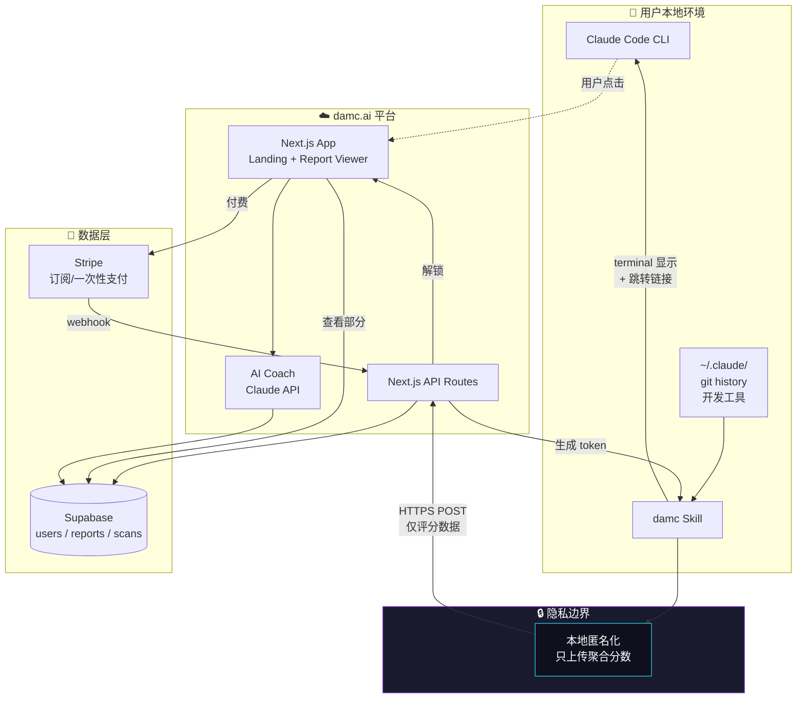
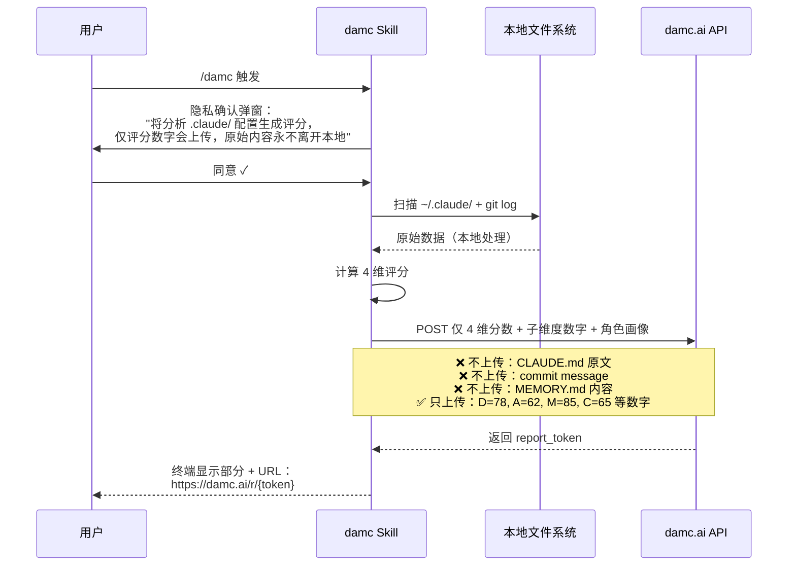
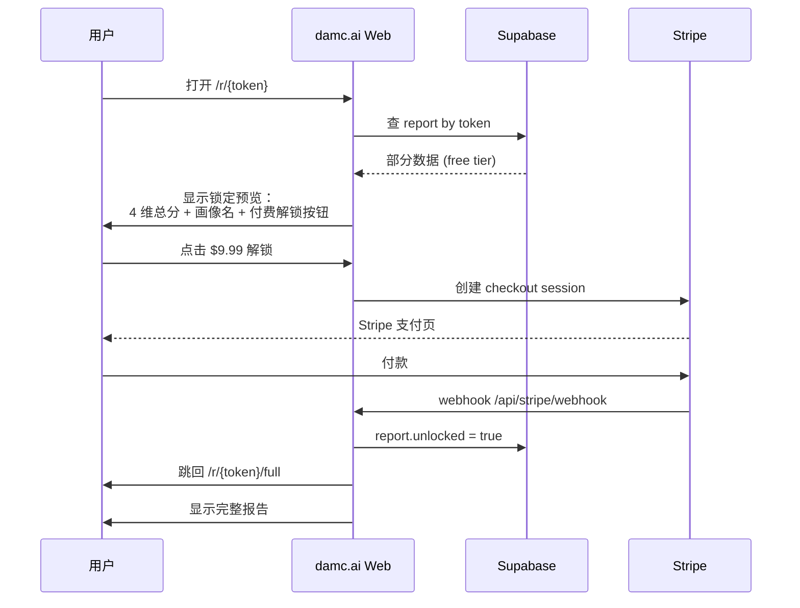
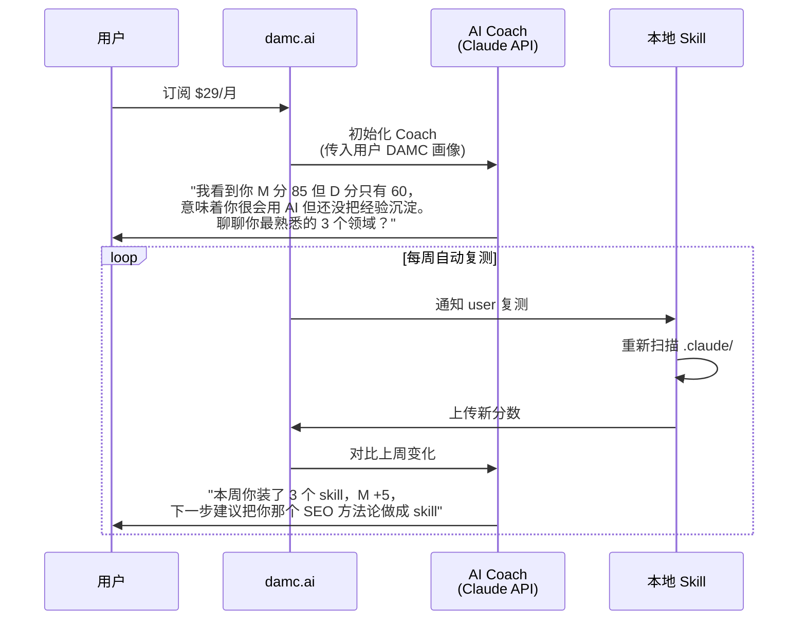
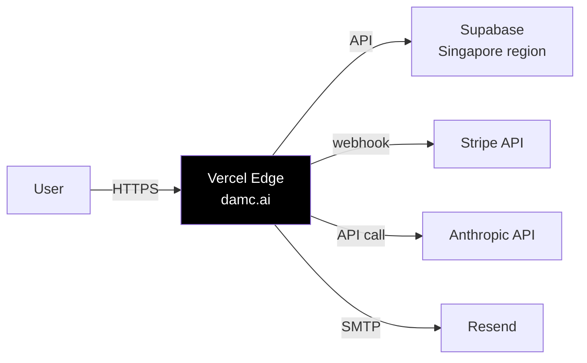

# DAMC 平台架构设计

> 终端 Skill 是钩子，平台是变现层。
> 用户在 CLI 看到部分数据，付费在 Web 解锁完整 Agent 体检报告。

## 1. 系统全景图



## 2. 数据流（核心三步）

### Step 1：本地扫描（永远本地，不上云）



### Step 2：用户跳转平台查看



### Step 3：AI Coach 持续陪伴（订阅用户）



## 3. 技术栈

| 层 | 技术 | 原因 |
|---|------|------|
| **Skill (CLI)** | Markdown + Bash + Python | 已有，零依赖 |
| **平台前端** | Next.js 14 App Router + Tailwind v4 + ShadCN UI | 用户已熟悉 |
| **平台后端** | Next.js API Routes | 同源部署，简单 |
| **数据库** | Supabase (Postgres) | 自带 Auth、RLS、Realtime |
| **支付** | Stripe Checkout + Webhooks | 国际化、订阅管理 |
| **AI Coach** | Anthropic Claude API (claude-sonnet-4-6) | 性价比最高，对话质量足够 |
| **部署** | Vercel | Next.js 最优 |
| **域名** | damc.ai (待注册) | 短、记得住 |
| **邮件** | Resend | 简单、便宜 |
| **分析** | Plausible / PostHog | 隐私友好 |

## 4. 数据库 Schema

```sql
-- 用户（Supabase Auth 自动管理）
users (id, email, created_at, ...)

-- 一次扫描的报告
reports (
  id           uuid PRIMARY KEY,
  token        text UNIQUE NOT NULL,         -- 短 URL token (如 'a7Bx9K')
  user_id      uuid REFERENCES users(id),    -- 可空（匿名扫描）
  scores       jsonb NOT NULL,               -- {D, A, M, C, subs}
  archetype    text,                          -- "AI架构师"
  role         text,                          -- 用户回答的角色
  unlocked     boolean DEFAULT false,         -- 是否已付费解锁
  unlock_tier  text,                          -- 'one_time' / 'coach' / 'team'
  created_at   timestamp DEFAULT now()
);

-- 订阅记录
subscriptions (
  id              uuid PRIMARY KEY,
  user_id         uuid REFERENCES users(id),
  stripe_sub_id   text,
  tier            text,                       -- 'coach' / 'team'
  status          text,                       -- 'active' / 'cancelled'
  current_period_end timestamp
);

-- AI Coach 对话历史
coach_sessions (
  id          uuid PRIMARY KEY,
  user_id     uuid REFERENCES users(id),
  messages    jsonb,                          -- chat history
  plan        jsonb,                          -- 90-day plan
  created_at  timestamp DEFAULT now()
);

-- 复测追踪
scan_history (
  id          uuid PRIMARY KEY,
  user_id     uuid REFERENCES users(id),
  scores      jsonb,
  scanned_at  timestamp DEFAULT now()
);
```

## 5. 隐私架构（核心信任承诺）

```mermaid
flowchart LR
    A[~/.claude/ 原始内容] -->|本地扫描<br/>本地计算| B[评分数字]
    B -->|HTTPS| C[damc.ai 服务器]
    A -.->|❌ 永远不传输| C

    style A fill:#1a1a2e,stroke:#22d3ee
    style B fill:#1a1a2e,stroke:#a855f7
    style C fill:#1a1a2e,stroke:#10b981
```



### 上传白名单（明示用户）

| 上传 ✅ | 不上传 ❌ |
|---------|----------|
| 4 个总分 (D/A/M/C) | CLAUDE.md 全文 |
| 22 个子维度评分 | MEMORY.md 内容 |
| 用户填的角色（"前端"） | git commit message |
| 用户填的 MBTI（可选） | skill 名字列表 |
| 桌面环境（macOS/Linux） | 项目路径 |
| Skill 总数（数字） | 邮箱（除非主动注册） |

### 三道防线

1. **本地优先**：所有原始数据在用户机器处理
2. **数字化**：上传只是评分（不可逆推原文）
3. **可删除**：用户可一键删除所有数据 `damc.ai/account/delete`

## 6. 部署拓扑



## 7. 安全要点

- API Routes 全部经过 Supabase RLS（Row Level Security）
- Skill 上传走带签名的 short-lived token
- Stripe webhook 签名验证
- 用户数据加密存储（Supabase 自带）
- 删除请求 24h 内执行（GDPR 合规）

---

**下一步**：见 `PRD.md` 的 2 周实施计划。
